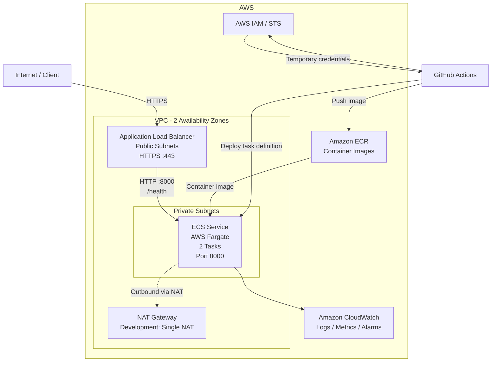

# Finzla Cloud Deployment Platform

This is a small AWS cloud deployment platform for a new
backend service demonstrating how a containerized Python
application is built, validated, secured, and deployed to AWS using Terraform
and GitHub Actions.

The solution uses Amazon ECS with AWS Fargate, Amazon ECR, an Application Load
Balancer, private application subnets, IAM least-privilege roles, GitHub OIDC,
CloudWatch monitoring, and Terraform.

The implementation intentionally remains small and understandable. Live AWS
deployment is not performed as part of this repository.

---

## Architecture



### Request Path

The customer request path is:

```text
Internet
   |
   | HTTPS :443
   v
Application Load Balancer
   |
   | HTTP :8000
   v
ECS Target Group
   |
   v
ECS/Fargate Task
   |
   v
FastAPI application
```

The Application Load Balancer is placed in public subnets.

The ECS tasks run in private subnets without public IP addresses. The ECS
security group accepts application traffic on port `8000` only from the ALB
security group, so the application containers are not directly exposed to the
Internet.

The ALB health check uses:

```text
GET /health
```

and expects HTTP `200`.

---

## Technology Choices

| Area | Technology |
|---|---|
| Application | Python / FastAPI |
| Container | Docker |
| Cloud | AWS |
| Container orchestration | Amazon ECS / Fargate |
| Container registry | Amazon ECR |
| Ingress | Application Load Balancer |
| Infrastructure as Code | Terraform |
| CI/CD | GitHub Actions |
| AWS authentication | GitHub OIDC / STS |
| Logging | Amazon CloudWatch Logs |
| Monitoring | CloudWatch Metrics and Alarms |
| Notifications | Amazon SNS |

ECS/Fargate was selected instead of EKS because this is a small stateless
service and does not require Kubernetes-specific functionality. Fargate
provides the required container orchestration while avoiding unnecessary
cluster and worker-node operational complexity.

Further engineering trade-offs are documented in
`docs/engineering-decisions.md`.

---

## Repository Structure

```text
.
├── .github/
│   └── workflows/
│       ├── deploy.yml
│       └── pr-validation.yml
├── app/
│   ├── tests/
│   │   └── test_health.py
│   ├── __init__.py
│   ├── main.py
│   ├── requirements.txt
│   └── requirements-dev.txt
├── docs/
│   ├── engineering-decisions.md
│   ├── incident-response.md
│   ├── monitoring.md
│   └── terraform-state.md
├── terraform/
│   ├── alb.tf
│   ├── ecr.tf
│   ├── ecs.tf
│   ├── github-deploy-policy.tf
│   ├── github-oidc.tf
│   ├── iam.tf
│   ├── internet-gateway.tf
│   ├── locals.tf
│   ├── monitoring.tf
│   ├── nat-gateway.tf
│   ├── networking.tf
│   ├── outputs.tf
│   ├── private-route-table.tf
│   ├── private-subnets.tf
│   ├── providers.tf
│   ├── public-route-table.tf
│   ├── public-subnets.tf
│   ├── security.tf
│   ├── terraform.tfvars.example
│   ├── variables.tf
│   ├── versions.tf
│   └── vpc.tf
├── .dockerignore
├── .gitignore
├── Dockerfile
├── pytest.ini
└── README.md
```

---

## Application

The application exposes two endpoints.

### Health

```text
GET /health
```

Expected response:

```json
{
  "status": "healthy"
}
```

### Version

```text
GET /version
```

The endpoint reports the deployed application version and environment.

For deployed workloads, the application version is populated using the
immutable Git commit SHA associated with the container image.

Configuration is supplied through environment variables:

```text
APP_ENV
APP_VERSION
```

Application logs are written to stdout/stderr so the container runtime can
forward them to CloudWatch Logs.

No application secrets are stored in the source code.

---

## Local Development

Create and activate a Python virtual environment and install development
dependencies.

### Git Bash / Linux

```bash
python -m venv .venv
source .venv/Scripts/activate
pip install -r app/requirements-dev.txt
```

Run the tests:

```bash
pytest
```

Run the application:

```bash
uvicorn app.main:app --host 0.0.0.0 --port 8000
```

Test the endpoints:

```bash
curl http://127.0.0.1:8000/health
curl http://127.0.0.1:8000/version
```

---

## Docker

Build the image:

```bash
docker build -t finzla-cloud-platform:local .
```

Run it:

```bash
docker run --rm \
  -p 8000:8000 \
  -e APP_ENV=development \
  -e APP_VERSION=local \
  finzla-cloud-platform:local
```

Verify:

```bash
curl http://127.0.0.1:8000/health
curl http://127.0.0.1:8000/version
```

The container runs as a non-root application user and includes a Docker health
check against `/health`.

---

## AWS Infrastructure

Terraform defines:

- a VPC;
- public subnets across two Availability Zones;
- private subnets across two Availability Zones;
- Internet Gateway;
- public and private route tables;
- NAT Gateway for private-subnet outbound connectivity;
- restricted security groups;
- Amazon ECR repository;
- ECS cluster;
- ECS/Fargate task definition and service;
- Application Load Balancer and target group;
- HTTPS listener design using an ACM certificate;
- IAM execution, task, and deployment roles;
- GitHub OIDC identity provider;
- CloudWatch log group;
- CloudWatch alarms;
- SNS alert topic.

The development design uses one NAT Gateway as a deliberate cost optimization.
A production environment could use per-AZ NAT Gateways or appropriate VPC
endpoints depending on resilience, traffic, and cost requirements.

---

## Terraform

Initialize Terraform for local static validation:

```bash
terraform -chdir=terraform init -backend=false
```

Format:

```bash
terraform -chdir=terraform fmt -recursive
```

Validate:

```bash
terraform -chdir=terraform validate
```

An example variable file is provided as:

```text
terraform/terraform.tfvars.example
```

No AWS credentials are stored in Terraform configuration.

### Remote State Strategy

A production implementation would use an S3 remote backend with:

- encryption;
- bucket versioning;
- public access blocked;
- least-privilege IAM access;
- state locking/concurrency protection;
- separate state objects for development and production.

The backend must be bootstrapped before the main Terraform configuration can
use it.

The complete state-management strategy is documented in
`docs/terraform-state.md`.

---

## CI/CD

Two GitHub Actions workflows are provided.

### Pull Request Validation

`.github/workflows/pr-validation.yml` validates application and infrastructure
changes before merge.

The workflow performs:

```text
Application tests
Docker build
Terraform format check
Terraform validation
Trivy security scan
```

The intended infrastructure workflow also includes Terraform planning when
AWS-backed planning credentials and remote state are available.

A live AWS-backed Terraform plan is not claimed as executed in this assessment.

### Application Deployment

`.github/workflows/deploy.yml` provides the application deployment flow.

The deployment:

1. obtains short-lived AWS credentials through GitHub OIDC;
2. authenticates to Amazon ECR;
3. builds the application container;
4. tags the image with the Git commit SHA;
5. pushes the image to ECR;
6. retrieves the current ECS task definition;
7. creates a new task-definition revision using the new image;
8. deploys the revision to ECS;
9. waits for ECS service stability;
10. performs an external application health check.

The workflow is manually triggered and requires the explicit deployment input
to be enabled.

The live deployment workflow has intentionally not been executed because live
AWS deployment is outside the scope chosen for this assessment.

---

## AWS Authentication

GitHub Actions uses OpenID Connect rather than permanent AWS access keys.

The trust relationship restricts role assumption to the intended GitHub
repository and branch.

This provides temporary AWS credentials through AWS STS and avoids storing
long-lived AWS access keys in GitHub.

The deployment role is deliberately restricted to the operations required for
the application deployment, including:

- pushing to the application ECR repository;
- registering ECS task definitions;
- describing the ECS service;
- updating the intended ECS service;
- passing only the required ECS execution and task roles.

It does not use `AdministratorAccess`.

For production, a separate deployment role and protected GitHub Environment
with approval requirements should be used.

---

## Security

The platform applies several security controls:

- ECS tasks run in private subnets.
- ECS tasks do not receive public IP addresses.
- Only the ALB is Internet-facing.
- ECS ingress on port `8000` is allowed only from the ALB security group.
- HTTPS is designed for client-to-ALB traffic.
- ECR uses immutable image tags.
- ECR image scanning is enabled.
- The container runs as a non-root user.
- GitHub uses OIDC and temporary AWS credentials.
- IAM deployment permissions are scoped rather than administrative.
- Application secrets are not committed to the repository.
- Trivy scans repository content during pull-request validation.
- CloudWatch logs use a defined retention period.

For a production fintech workload, secrets should be supplied at runtime using
an approved service such as AWS Secrets Manager or Systems Manager Parameter
Store.

---

## Monitoring and Alerting

Application logs are written to:

```text
/ecs/finzla-cloud-platform-<environment>
```

with a 30-day retention period.

The platform monitors useful service indicators including:

- unhealthy ALB targets;
- application 5xx responses;
- ECS CPU utilization;
- ECS memory utilization;
- ALB target response time.

CloudWatch alarms publish to an SNS alert topic.

The detailed monitoring strategy and initial investigation guidance are
documented in:

```text
docs/monitoring.md
```

---

## Deployment Failure and Rollback

The ECS service enables the deployment circuit breaker with rollback.

If a deployment cannot reach a healthy steady state, ECS can fail the
deployment and roll back to the previous deployment.

GitHub Actions also waits for ECS service stability and then performs an
external health check.

A failed external post-deployment health check currently fails the workflow but
does not itself initiate an ECS rollback. In a production implementation this
would be extended to restore the last known healthy task definition
automatically.

---

## Incident Response

The repository includes an incident runbook for the scenario where:

```text
Deployment succeeds
ECS tasks appear to be running
Customers receive HTTP 503
ALB targets are unhealthy
```

The investigation covers:

- ALB target health;
- ECS service state and events;
- ECS task status;
- CloudWatch application logs;
- application health endpoint;
- port and target-group configuration;
- security-group connectivity;
- rollback to the last known healthy task definition.

See:

```text
docs/incident-response.md
```

---

## Cost Considerations

The two primary cost areas considered for this small architecture are:

### NAT Gateway

NAT Gateway has an hourly charge and data-processing cost. Development uses a
single NAT Gateway as a cost optimization.

Production availability requirements may justify per-AZ NAT Gateways or VPC
endpoints.

### Fargate Compute

Fargate cost depends on allocated CPU, memory, task count, and runtime.

The workload starts with relatively small task resources and two tasks.
Production sizing should be based on load testing and observed CloudWatch
metrics.

Additional costs include the Application Load Balancer, CloudWatch, ECR
storage, and network transfer.

---

## Terraform State and Environment Separation

Shared Terraform state should not be stored only on a developer workstation.

The production design uses remote S3 state with locking/concurrency protection
and separate state for development and production.

For stronger isolation, production and non-production workloads should ideally
use separate AWS accounts and separate deployment identities.

See:

```text
docs/terraform-state.md
```

---

## Production Readiness Improvements

Before this platform is used for a production fintech workload, key
improvements would include:

1. stronger production governance using separate AWS accounts, protected
   GitHub environments, approval gates, and production-specific IAM roles;

2. stronger security controls including managed secrets, KMS-backed encryption
   where required, WAF, audit logging, and threat detection;

3. higher availability and operational maturity including autoscaling,
   multi-AZ outbound connectivity or VPC endpoints, synthetic monitoring,
   automated post-deployment rollback, tested disaster recovery, and
   service-level objectives.

More detail is available in:

```text
docs/engineering-decisions.md
```

---

## Assessment Evidence

The following have been executed during development:

- Python unit tests;
- local application endpoint checks;
- Docker image build;
- Docker container health check;
- non-root container verification;
- Terraform formatting;
- Terraform validation;
- GitHub pull-request validation workflows.

The following are implemented as configuration but are intentionally not
claimed as live-tested:

- GitHub-to-AWS OIDC authentication;
- ECR image push;
- ECS deployment;
- AWS load-balancer health verification;
- CloudWatch alarms in a live environment;
- remote Terraform backend;
- AWS-backed Terraform plan.

No live AWS infrastructure is provisioned as part of the submitted assessment.

---

## Known Limitations

This repository is an assessment implementation rather than a complete
production platform.

Notable limitations include:

- AWS infrastructure has not been provisioned live;
- Terraform remote state is documented but not provisioned;
- AWS-backed `terraform plan` evidence is not claimed;
- deployment and rollback configuration has not been exercised against a live
  ECS service;
- production GitHub approval gates are described but not configured;
- alert notification destinations are not configured;
- production disaster recovery and autoscaling are outside the implemented
  scope.

These limitations are intentionally stated rather than presenting unexecuted
infrastructure as tested.

---

## Additional Documentation

- `docs/engineering-decisions.md` — architecture, reliability, cost, and
  production-readiness decisions.
- `docs/incident-response.md` — HTTP 503 / unhealthy ALB target investigation
  and recovery.
- `docs/monitoring.md` — metrics, alarms, logs, and investigation guidance.
- `docs/terraform-state.md` — remote-state, locking, security, and environment
  strategy.